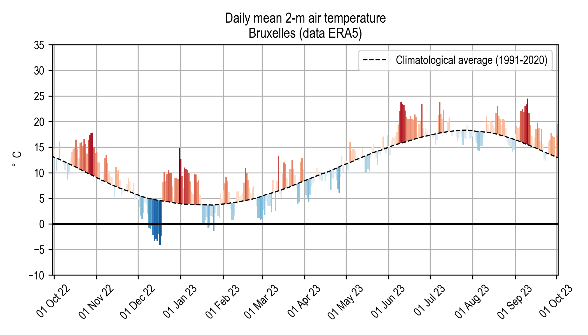
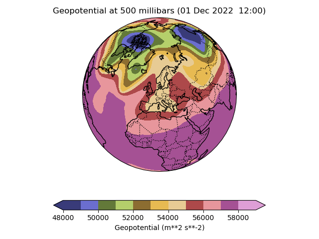

# LPHYS2163 Project 2:  How geostrophic is the real wind?

In this project, you will learn to play with real atmospheric data and
apply theoretical concepts seen in the course to practical situations.

## Step 1. Watch a video.

[Here is a 5-minute video](https://www.youtube.com/watch?v=J1ckvu8Go58)
that shows the evolution, hour by hour for the
period October 1st 2022 to September 30th 2023, of four variables:

* The geopotential at the 500 hPa (or millibars) level, in m2/s2
* The air temperature at the 500 hPa level, in K
* The geopotential at the 1000 hPa level
* The air temperature at the 1000 hPa

In addition, you can find below a plot of the 2-m air temperature in
Brussels for the same period. The dashed black lines represents the
climatological average over 1991-2020 and the colored bars illustrate
the deviation from the average.

  

Your first task is to have a look at the video and to answer the
following questions:

* Where on Earth is the geopotential highest or lowest, and why?
* Do you see a seasonal dependence in the four fields that are displayed?

Next, you are asked to focus your attention on the four following periods:

1. 15 October 2022 - 1 November 2022 (cold)
2. 1 December 2022 - 15 December 2022 (warm)
3. 25 December 2022 - 15 January 2023 (warm)
4. 1 September - 10 September 2023 (warm)

For each of these periods, characterize the geopotential and temperature
fields aloft and near the ground. What explains these contrasts in 2-m
air temperature?

## Step 2. Producing the map of a 2-D variable

The second task is a technical one and ensures that you will have
familiarized yourselves with the softwares used in geosciences to plot data.
The suggested language for
coding is Python but alternatives are accepted, of course.

Your objective is to plot a map of the geopotential of
the atmosphere at the 500 hPa level, on the 1st of December 2022 at
12:00 UTC.

The data is already available in the folder `./data/` under the name
`sample_20221201_1200.nc`. This file is a "NetCDF" file, a common format
used in geosciences. It features five variables:

- Temperature of the air (`t`)
- Geopotential (`z`)
- Zonal component of the wind (`u`)
- Meridional component of the wind (`v`) 
- Relative vorticity (`vo`)

The variables are available at two pressure levels: 500 hPa (middle
atmosphere) and 1000 hPa (surface).

You must first produce a map of the geopotential at the 500 hPa level
like this one:

  

## Step 3. Calculating and plotting a gradient in spherical coordinates

The geopotential data recorded in the NetCDF file above is referenced 
in a spherical coordinate system
(longitude-latitude). As seen in the lectures, the geostrophic wind in 
pressure coordinates reads:

$$\mathbf{u}_{g} = \frac{1}{f}\mathbf{k}\times\nabla \Phi$$

with $f=2\Omega \sin\phi$ the Coriolis parameter ($\Omega$ is the angular velocity of the Earth), $\mathbf{k}$ a unit vector pointing
upwards, $\Phi$ the geopotential and $\nabla \Phi$ its gradient taken on surfaces of equal pressure, i.e., on isobaric surfaces.

You are first asked to derive the analytical expression of the gradient
of the geopotential in spherical coordinates $(\lambda, \phi)$ for the zonal
(in the direction of $\mathbf{i}$) and meridional (in the direction of
$\mathbf{j})$ components.

Next, you are asked to estimate this gradient using finite
differentiation. Given some 2-D field $A(x,y)$, the partial derivatives
of $A$ can be estimated with a central difference scheme as:

$$\frac{\partial A}{\partial x} \approx \frac{A(x_{i+1}, y_{i}) -
A(x_{i-1}, y_{i})}{2\Delta x}$$

and

$$\frac{\partial A}{\partial y} \approx \frac{A(x_{i}, y_{i + 1}) -
A(x_{i}, y_{i - 1})}{2\Delta y}$$

where $(x_{i}, y_{i})$ are the coordinates of the grid point where the
gradient has to be calculated, $x_{i-1}$ ($x_{i + 1}$) is the
$x$ coordinate of the grid point located left (right) of the reference
grid point, and $y_{i-1}$ ($y_{i+1}$) is the $y$ coordinate of the
grid point located below (above) of the reference grid point, and
$\Delta x$ and $\Delta y$ are the (uniform) grid spacings along the $x$
and $y$ directions, respectively.

Write a function that takes as input any scalar field, a longitude and a
latitude coordinates, and returns the gradient of that field in spherical coordinates.
Be aware that in the NetCDF file provided, the longitudes are expressed in degrees from
0 $^\circ$ to 360 $^\circ$, while the latitudes are expressed in degrees from 
90 $^\circ$ to -90 $^\circ$ (i.e., in descending order).

You are now asked to plot separately the zonal and meridional components
of the gradient of the geopotential, and to plot the resulting 2-D
vector field using quivers (arrows). Make sure that the gradient (thus,
a vector field) corresponds your expectations based on the spatial
distribution of the geopotential.

## Step 4. Comparing the geostrophic and the real wind

Now that you have estimated the gradient of the geopotential, you can
plot the geostrophic wind using the equation above. Plot it (direction
with quivers, and magnitude with a colormap). Then, compare the
geostrophic wind with the real wind that is available from the variables
$u$ and $v$ in the file. Comment on the agreement (or disagreement)
between the two winds. Specifically, is the geostrophic wind a better approximation
aloft (500 hPa) or at the surface (1000 hPa)? Is it a better
approximation over sea or over the continents? Is it a better
approximation in regions of strong horizontal gradients of geopotential,
or in regions of weak horizontal gradients? Is it a better approximation
at high, or low latitudes?

## Step 5. Case study: the Omega blocking
You are finally asked to look at the second file
 `./data/sample_20230905_1200.nc` that contains the same variables as before but for 
 the 5th of September 2023 at 12.00. This period was marked by a strong blocking
 event, which produced a high-pressure system over Belgium. Simultaneously, two very low
 pressure systems developed on the flanks of the anticyclone. The low pressure system on the
 eastern side gave rise to storm Daniel that struck Libya with unprecedented floods there.
 
 Plot the geopotential at 500 hPa on that day. Why is this synoptic situation called an "Omega blocking"?
 
 Can you spot storm Daniel? What is the relative vorticity field on that day?
 
 
## Project guidelines
Each group will submit a report no longer than 10 pages (including figures) following the guidelines described above. The group must also submit the software code that they produced (this does not count in the page limit). The deadline for submission of the report is the 15th of December 2023.
Reports must be sent by email to [francois.massonnet@uclouvain.be](francois.massonnet@uclouvain.be)

The groups will present their findings (10 min presentation + 10 min of questions and answers) on Tuesday 19 December at 10.45.
