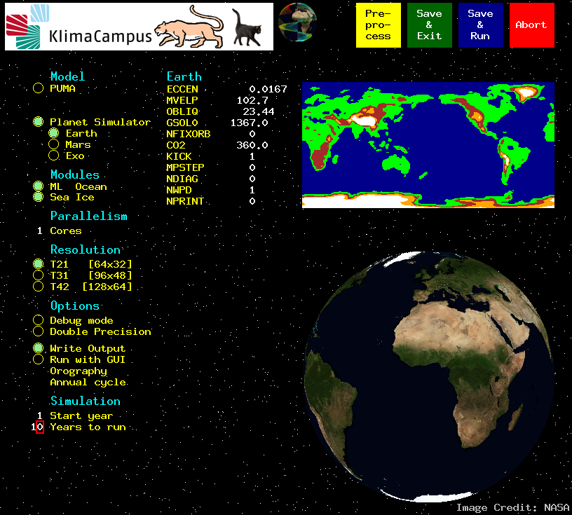
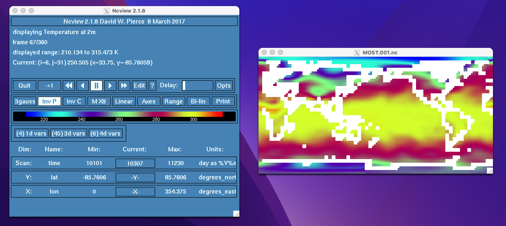

# LPHYS2268 hands-on activity
## Understanding climate prediction concepts with PlaSim


### Weeks 1-3: Producing a control simulation

#### 1. Creating an account on the ELIC servers.

Each student will create an account on the ELIC servers. A few students might already have such an account, so this step is not necessary for them.

Connect to the "Calcul Intensif et Stockage de Masse" (CISM) [login creation page](https://www.cism.ucl.ac.be/doc/_contents/About/cilog.html). **The login can only be created from within the university network** (or via a VPN). Then, follow the instructions. Regarding the affiliation, choose ELI/ELIC. Regarding the projects, tick "Interactive computing".

Once you receive your login, let [Pierre-Yves Barriat](mailto:pierre-yves.barriat@uclouvain.be) and he will create an access to the ELIC servers with the same login as the CISM one.

#### 2. Connecting to your account on the `coriolis` server

You have different options:
- connecting from a PC of the informatics room on the third floor with your credentials
- connecting from your own PC:
	- Open a terminal (e.g., [MobaXterm](https://mobaxterm.mobatek.net/download-home-edition.html) for Windows; on Linux and Mac OS, type 'terminal' in the search bar)
	- Do `ssh -X <user>@www.climate.be`
	- You should arrive on a "gateway", from where you can do `ssh -X <user>@coriolis.elic.ucl.ac.be`

#### 3. Copying the PlaSim code in your local repository

The `mkdir` allows creating a new folder and the `cd` command allows navigating through the architecture of the machine. Go to your "home" directory and create a repository for this course:

`cd /home/elic/<user>`

`mkdir LPHYS2268`

and then enter it:

`cd LPHYS2268`


Next, you need to copy the PLASIM code locally. The `cp` command can do the job:

`cp /home/elic/fmasson/PlaSim-LPHYS2268.tar.gz ./`
	
then unwrap the archive:

`tar xzf PlaSim-LPHYS2268.tar.gz` (takes about a minute)

#### 4. Configure the setup and compile the model code

Look at what is inside the directory by doing `ls`. Then go to the `PlaSim` main directory, check that the file `configure.sh` is there and configure the architecture of the model to match the `coriolis` server with

`./configure.sh`

When this is done, you can compile the model code. Run the "Model Starter" (MoSt):

`./most.x`

In case you get a message like 'Most: cannot connect to X server localhost:16.0', make sure you have added the "-X" option when doing the `ssh` command above.

This command opens a graphical user interface (GUI) where you can decide a couple of options. Check the options to match the following setup:

<p align="center">

</p>

Then, click the green button "Save and Exit". **Do not close the GUI**. You can track the compilation (~30 seconds) in the terminal. Once the compilation is over, an executable file named `plasim/bin/most_plasim_t21_l10_p1.x` should have been created. If that is not the case, the compilation step did not work properly.

#### 5. Execute the simulation

**NOTE**: anytime a simulation is performed, the suite of tools CDO (Climate Data Operators) has to be loaded. This can be done each time by doing `module load CDO`. Alternatively, you can add `module load CDO` in the file `/home/elic/<user>/.bashrc` that is loaded at every login.

Go to `plasim/run` and execute:

``./most_plasim_run``

If that does not produce an error within 10 seconds, then the model is running :-). Because we do not want to wait in front on the screen, we can launch this task in the background. To do so, kill the current run by doing CTRL+C. Then, do:

`nohup ./most_plasim_run >& log &`

The `nohup ... &` executes the script in the background and allows the user continuing working on other tasks. It also allows disconnecting from the server and reconnecting later with the task in the background. The `>& log` redirects the output (if any) of the command in a file that will be created and called `log` (any name can be given). 

You can monitor the progress of the simulation by looking at the text file `plasim_diag` that should be filled dynamically as the run proceeds. By filtering the result of the `cat` command on `plasim_diag` with the string "Completed" you can find out how many months have already been completed:

```
cat plasim_diag | grep Completed
Completed month 01-0001
Completed month 02-0001
Completed month 03-0001
Completed month 04-0001
```
Note that a new `plasim_diag` file is created for each new year of simulation.
The model runs at about 20 seconds per simulated month; so the 10-yr run should take around 40 minutes.

#### 6. Visualizing the results

A convenient format to visualize the ouput is NetCDF (\*.nc files). After the simulation, several ocean and sea ice files should already be available as NetCDF: `MOST_OCE.<year>.nc`and `MOST_ICE.<year>.nc`. Verify their presence.

The atmospheric outputs are contained in the binary files `MOST.\<year\>`. To convert these binary files, we have to use a postprocessor. For that, copy the file `srv2nc` located in the `tools` directory in the main `PlaSim` folder, to the run directory. Then, run:

```
./srv2nc -p MOST.001 MOST.001.nc
```

Note that this command also requires CDO (do a `module load CDO` if needed).

This command converts the atmospheric file of year 1 to its NetCDF equivalent. The `-p` option is important to compute the sea level pressure from the state variables.

Load the ncview module that allow using visualization tools by doing `module load ncview` (this command can also be included in your `bashrc` file as for the CDO command). Then, open the resulting file:

```
ncview MOST.001.nc
```

A blue window should open, and you can look at the map of different variables. The window looks like this, for day 67 of the first year:

<p align="center">

</p>

You can find the meaning of the variables and their names by dumping the header of that file:
```
ncdump -h MOST.001.nc
```

Note that years contain 360 days in the model (30 days per month).

#### 7. Plotting the results

For this first week, you are asked to plot the time series of annual mean global mean temperature at 2 m for the 10 years of the simulation that you produced. The grid of PLASIM on which the atmospheric data is saved is a regular latitude-longitude grid of dimensions 64 by 32, i.e., 5.625° by 5.625°. The area of each grid cell is given by the formula 

$$A = (a \  \cos\phi \  d\lambda) (a \  d\phi)$$
with $a$ the Earth radius, $\phi$ the latitude (in radians) and $d\lambda$ and $d\phi$ the grid resolution in radians.


### Weeks 4-6: Predictability

For this secon part, you are going to estimate the initial-value predictability (or predictability of the first kind) of the PLASIM model.

As we have seen in the lecture, predictability can be defined as the extent by which two probability density functions differ from one another: the forecast PDF conditioned on observations available at initial time, and the unconditional forecast PDF equivalent to the climatological PDF. Thus, we need to datasets to estimate the PDFs from.

#### 1. The climatological pdf

The work of Weeks 1-3 has not really allowed to produce long enough integrations of the PLASIM model. Fortunately, a long control simulation has been conducted for you. You can find it at: 

`/cofast/fmasson/LPHYS2268/CTRL`

under the files `CTRL.?????.nc` where ????? refer to the year of the run.

Plot the time series of the global mean annual mean 2m air temperature for the last 500 years of the simulation. 

Also, plot the histogram of the temperature.


#### 2. The forecast PDF

A 100-member ensemble 10-yr simulation has been started from the restart of the CTRL run at the end of year 2999. The data is stored in 

`/cofast/fmasson/LPHYS2268/PPP/`

under the files `PPP_xxx.????.nc` where xxx refers to the ensemble member (001, 002, ... 100) and ???? refers to the year of the run.


#### 3. Predictability

Plot the global mean temperature for each ensemble member, for each day of the first year. Compare the variance of the ensemble with the climatological variance estimated, say, over 25000-2599. Derive an estimate of the initial-value predictability of PlaSim.


